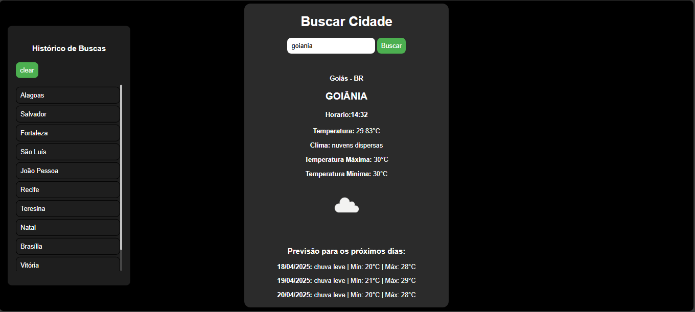

Aqui está um exemplo de `README.md` para o seu projeto de clima com histórico de buscas e previsão dos próximos dias:

---

# 🌤️ App de Previsão do Tempo

Este projeto é um aplicativo web que utiliza a API da OpenWeatherMap para exibir informações meteorológicas de uma cidade informada pelo usuário. Ele mostra a temperatura atual, a descrição do clima, a previsão para os próximos dias, o horário local da cidade e mantém um histórico das cidades pesquisadas.

---

## 🚀 Funcionalidades

- Busca por cidade e exibição do clima atual (com ícone)
- Exibição de:
  - Temperatura atual, máxima e mínima
  - Descrição do clima
  - Horário local da cidade
- Previsão para os próximos 3 dias
- Histórico de cidades pesquisadas (armazenado no `localStorage`)
- Repetir busca clicando em uma cidade do histórico
- Limpar histórico de buscas

---

## 🧪 Tecnologias Utilizadas

- HTML5
- CSS3
- JavaScript (Vanilla JS)
- API da [OpenWeatherMap](https://openweathermap.org/)

---

## 🔑 Pré-requisitos

- Navegador moderno
- Uma chave de API gratuita da OpenWeatherMap

Você pode obter a chave gratuitamente criando uma conta em: [https://home.openweathermap.org/users/sign_up](https://home.openweathermap.org/users/sign_up)

---

## ⚙️ Como Usar

1. Clone ou baixe este repositório.
2. No arquivo `script.js`, substitua a chave da API pela sua:

```javascript
const chave = "SUA_CHAVE_AQUI";
```

3. Abra o arquivo `index.html` em seu navegador.

4. Digite o nome de uma cidade e clique em **"Buscar"**.

---

## 🗃️ Organização do Código

- `buscarClima()` – Função principal que obtém os dados da cidade e chama outras funções auxiliares.
- `previsao()` – Busca e organiza os dados de previsão dos próximos dias.
- `buscarCidade()` – Obtém as coordenadas geográficas da cidade.
- `calcHorario()` – Calcula o horário local da cidade com base no timezone.
- `mostrarHistorico()` – Renderiza o histórico salvo no `localStorage`.
- `limparHistorico()` – Remove o histórico de buscas.
- `buscarThis(elemento)` – Permite repetir uma busca ao clicar em uma cidade do histórico.

---

## 📷 Exemplo de Tela



---

## 📝 Licença

Este projeto é livre para fins educacionais e pessoais.

---

Se quiser, posso gerar esse `README.md` como arquivo direto pra você baixar ou já inserir no seu projeto. Deseja isso?